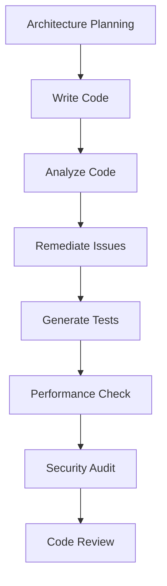

# Common Workflows

This guide covers common development workflows using the React Native MCP Server.

## Table of Contents

1. [Daily Development Workflow](#daily-development-workflow)
2. [Code Review Workflow](#code-review-workflow)
3. [Performance Optimization](#performance-optimization)
4. [Security Audit Workflow](#security-audit-workflow)
5. [Testing Strategy](#testing-strategy)
6. [Package Management](#package-management)
7. [Debugging Workflow](#debugging-workflow)
8. [Architecture Planning](#architecture-planning)

## Daily Development Workflow

### Morning: Review and Plan

**Step 1: Check for Updates**
```
Check if there are any updates available for the MCP server
```

**Step 2: Audit Dependencies**
```
Audit packages in my React Native project at /path/to/project
```

### Development: Build Features

**Step 3: Analyze Before Writing**
```
Give me architecture advice for implementing a user profile screen with:
- Photo upload
- Form validation
- API integration
- Offline support
```

**Step 4: Write Code**
Write your component following the recommendations.

**Step 5: Analyze Your Code**
```
Analyze this component for best practices and potential issues:

[paste your component code]
```

**Step 6: Fix Issues**
```
Remediate the code with expert-level fixes for the issues found
```

**Step 7: Generate Tests**
```
Generate a comprehensive test suite for this component
```

### Evening: Wrap Up

**Step 8: Run Comprehensive Analysis**
```
Analyze my codebase at /path/to/project focusing on:
- Security
- Performance
- Code quality
```

**Step 9: Review Recommendations**
Review and prioritize the recommendations for tomorrow.

## Code Review Workflow

### Pre-Review Checklist

**Step 1: Component Analysis**
```
Analyze the following components for code review:
- Component1.tsx
- Component2.tsx
- Component3.tsx

Focus on:
- Type safety
- Performance
- Accessibility
- Security
```

**Step 2: Test Coverage Check**
```
Analyze test coverage gaps in my project at /path/to/project
```

**Step 3: Security Scan**
```
Analyze codebase comprehensively at /path/to/project with focus on security vulnerabilities
```

### During Review

**Step 4: Use Code Review Prompt**
```
Use the react-native-code-review prompt to review this pull request:

[paste changed files]
```

**Step 5: Document Findings**
Create a review checklist based on findings:
- [ ] Critical issues addressed
- [ ] Tests added/updated
- [ ] Documentation updated
- [ ] Performance considerations reviewed

### Post-Review

**Step 6: Apply Fixes**
```
Remediate the following issues found in code review:
- Issue 1: [description]
- Issue 2: [description]

[paste code]
```

## Performance Optimization

### Initial Assessment

**Step 1: Performance Analysis**
```
Analyze codebase performance at /path/to/project

Focus on:
- FlatList performance
- Memory leaks
- Bundle size
- Navigation performance
```

### List Performance

**Problem**: Slow FlatList scrolling

**Step 2: Analyze List Component**
```
Analyze this FlatList implementation for performance issues:

[paste FlatList code]
```

**Step 3: Get Optimization Recommendations**
```
Optimize performance for this FlatList component.
Focus on:
- Rendering optimization
- Memory usage
- Scroll performance
```

**Step 4: Apply Optimizations**
```
Refactor this component to implement the recommended optimizations:

[paste component]
```

### Memory Leak Detection

**Problem**: App crashes after prolonged use

**Step 5: Memory Analysis**
```
Analyze this component for memory leaks and retention issues:

[paste component with subscriptions/listeners]
```

**Step 6: Fix Memory Leaks**
```
Remediate this code to fix memory leaks identified in the analysis
```

### Bundle Size Optimization

**Step 7: Bundle Analysis**
```
Analyze my project for bundle size optimization opportunities at /path/to/project
```

**Step 8: Apply Recommendations**
- Remove unused dependencies
- Implement code splitting
- Optimize imports

## Security Audit Workflow

### Pre-Release Security Check

**Step 1: Comprehensive Security Audit**
```
Analyze codebase comprehensively at /path/to/project

Focus on:
- Security vulnerabilities
- Hardcoded secrets
- Insecure data storage
- Network security
```

**Step 2: Package Vulnerability Scan**
```
Audit packages at /path/to/project and auto-fix critical vulnerabilities
```

**Step 3: Review Security Issues**
Review the findings and prioritize by severity:
- 🔴 Critical: Fix immediately
- 🟡 High: Fix before release
- 🟢 Medium: Schedule for next sprint
- 🔵 Low: Document for future

**Step 4: Fix Security Issues**
```
Remediate these security vulnerabilities:

[paste code with issues]
```

### Common Security Issues

#### Hardcoded API Keys

**Problem**: API keys in source code

```tsx
// ❌ BAD
const API_KEY = 'example_hardcoded_key_BAD_PRACTICE';

// ✅ GOOD
import Config from 'react-native-config';
const API_KEY = Config.API_KEY;
```

**Fix**:
```
Remediate this code to remove hardcoded secrets and use environment variables
```

#### Insecure Storage

**Problem**: Sensitive data in AsyncStorage

```tsx
// ❌ BAD
await AsyncStorage.setItem('password', password);

// ✅ GOOD
import * as Keychain from 'react-native-keychain';
await Keychain.setGenericPassword('username', password);
```

**Fix**:
```
Remediate this code to use secure storage for sensitive data
```

## Testing Strategy

### Setting Up Tests

**Step 1: Analyze Current Testing Strategy**
```
Analyze testing strategy for my project at /path/to/project
```

**Step 2: Get Recommendations**
Review recommendations for:
- Test coverage goals
- Testing tools
- CI/CD integration

### Writing Tests

**Step 3: Generate Unit Tests**
```
Generate unit tests for this component:

[paste component]

Include:
- Rendering tests
- Interaction tests
- Edge cases
```

**Step 4: Generate Integration Tests**
```
Generate integration tests for this flow:

[describe user flow]
```

### Improving Coverage

**Step 5: Coverage Analysis**
```
Analyze test coverage gaps at /path/to/project
```

**Step 6: Fill Gaps**
```
Generate tests for uncovered components:
- Component1.tsx
- Component2.tsx
```

## Package Management

### Regular Maintenance

**Step 1: Check for Updates**
```
Check for package updates in /path/to/project
```

**Step 2: Plan Upgrades**
Review update recommendations:
- Breaking changes?
- Peer dependency conflicts?
- Security fixes?

**Step 3: Upgrade Packages**
```
Upgrade packages in /path/to/project:
- react-native from 0.71.0 to 0.73.0
- react-navigation from 6.0.0 to 6.1.0
```

### Dependency Conflicts

**Problem**: Peer dependency conflicts

**Step 4: Resolve Conflicts**
```
Resolve dependency conflicts in /path/to/project
```

**Step 5: Verify Resolution**
```bash
npm install
npm test
```

### Deprecated Packages

**Problem**: Package is deprecated

**Step 6: Find Alternatives**
```
Migrate deprecated packages in /path/to/project:
- Old package: react-native-community/async-storage
```

## Debugging Workflow

### General Debugging Process

**Step 1: Describe the Issue**
```
Debug this issue in my React Native app:

Platform: Android
Issue: App crashes when navigating to Profile screen
Error: Cannot read property 'name' of undefined

[paste relevant code]
```

**Step 2: Get Debug Guidance**
The `debug_issue` tool provides:
- Possible causes
- Debug strategies
- Platform-specific guidance
- Common fixes

**Step 3: Analyze the Code**
```
Analyze this component for the bug:

[paste component causing the issue]
```

**Step 4: Apply Fix**
```
Remediate this code to fix the bug identified
```

### Platform-Specific Issues

#### iOS-Specific

```
Debug iOS-specific issue:

The app crashes only on iOS 16+ when using dark mode
[paste code]
```

#### Android-Specific

```
Debug Android-specific issue:

Back button navigation not working correctly
[paste navigation code]
```

## Architecture Planning

### New Project Setup

**Step 1: Get Architecture Guidance**
```
Give me architecture advice for a new e-commerce app with:
- Product catalog
- Shopping cart
- Checkout flow
- User authentication
- Order tracking
- Push notifications
```

**Step 2: Review Recommendations**
Review recommendations for:
- Project structure
- State management
- Navigation architecture
- Data layer design
- Module organization

### Refactoring Existing Project

**Step 3: Analyze Current Architecture**
```
Analyze architecture of my project at /path/to/project

Provide recommendations for:
- Better code organization
- State management improvements
- Separation of concerns
```

**Step 4: Plan Refactoring**
Create refactoring plan based on recommendations:
1. Extract business logic
2. Implement state management
3. Improve module boundaries
4. Add proper typing

**Step 5: Incremental Refactoring**
```
Refactor this component to follow the recommended architecture:

[paste component]
```

## Combined Workflows

### Feature Development End-to-End



**Complete Flow**:
```
1. Get architecture advice for the feature
2. Write the implementation
3. Analyze the code for issues
4. Remediate any problems found
5. Generate comprehensive tests
6. Check performance implications
7. Run security audit
8. Prepare for code review
```

### Pre-Release Checklist

**Use this workflow before any release**:

```
1. ✓ Audit packages for vulnerabilities
2. ✓ Analyze codebase comprehensively
3. ✓ Check test coverage
4. ✓ Run performance analysis
5. ✓ Security audit
6. ✓ Update dependencies
7. ✓ Generate missing tests
8. ✓ Final code review
```

## Tips for Efficient Workflows

### 1. Create Shortcuts

Save common prompts as templates:
```
Daily audit: "Audit packages and analyze codebase at /path/to/project"
Quick review: "Analyze and remediate this component: [code]"
```

### 2. Batch Operations

Analyze multiple files together:
```
Analyze these components in one request:
- Component1.tsx
- Component2.tsx
- Component3.tsx
```

### 3. Use Focus Areas

Narrow the scope for faster results:
```
Analyze this component focusing only on performance
```

### 4. Automate Repetitive Tasks

Create scripts that:
- Run daily audits
- Generate tests for new components
- Check for security issues in PRs

### 5. Document Patterns

When the MCP server identifies patterns:
- Save good examples
- Document anti-patterns to avoid
- Create team guidelines

## Next Steps

- **Code Remediation**: Learn about [automatic code fixes](../code-remediation/)
- **Testing Examples**: See [test generation](../testing/)
- **Package Management**: Explore [dependency management](../package-management/)

---

**Previous**: [← Getting Started](./getting-started.md)
**Next**: [Code Remediation Examples](../code-remediation/) →
